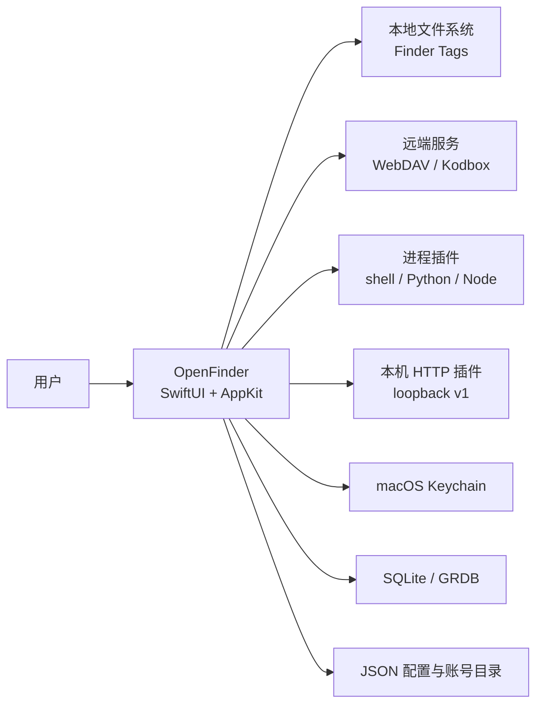
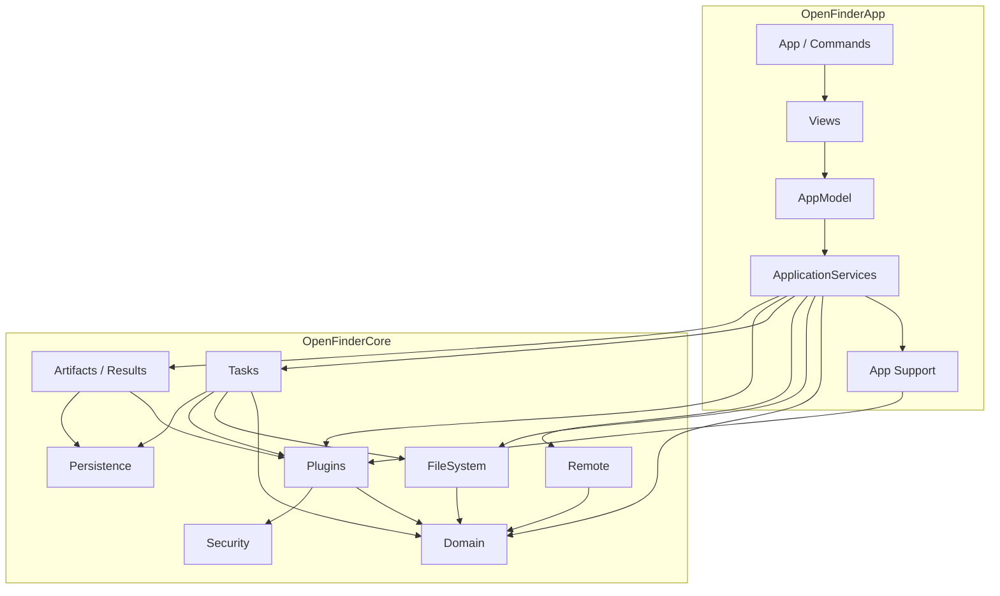
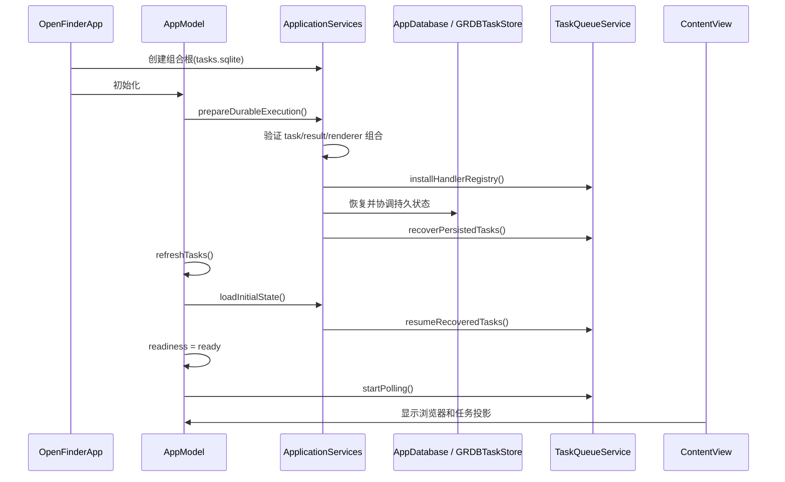
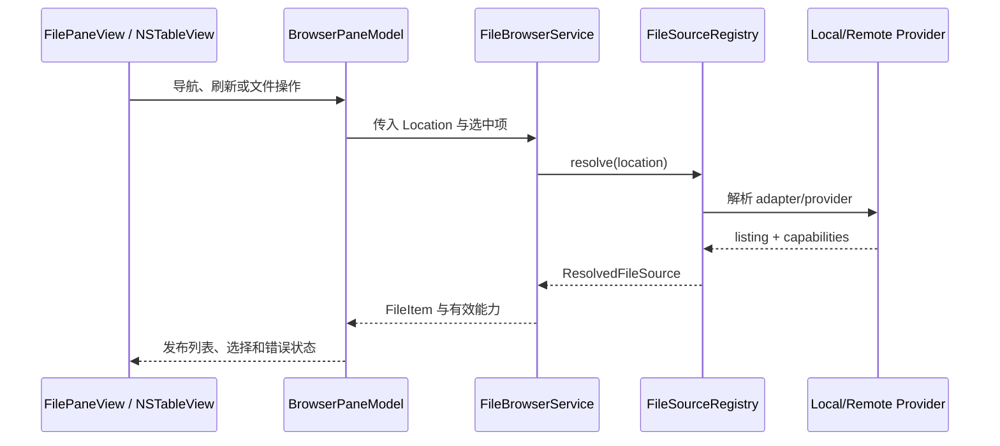
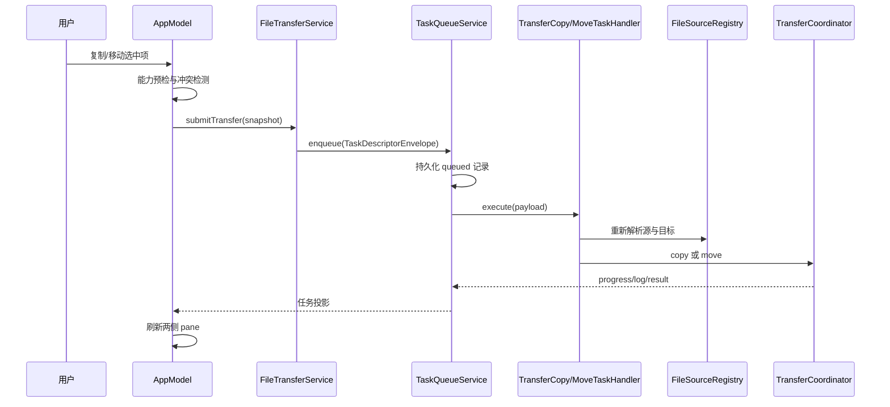
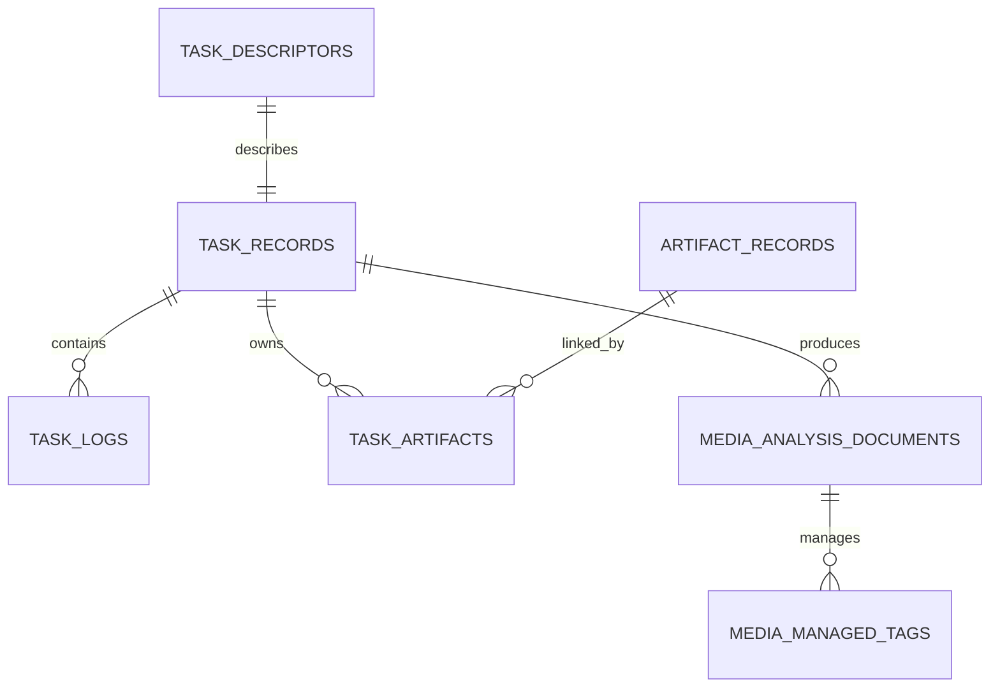

# OpenFinder 系统架构

本文解释 OpenFinder 当前实现的系统边界、依赖方向和关键调用链。它面向维护者，不是产品路线图；未落地的设想仍留在 [`plan.md`](plan.md)，不能据此推断当前行为。

## 系统定位

OpenFinder 是 macOS 14+ 的原生双栏文件工作区。它把本地文件、WebDAV 和 Kodbox 统一为带能力声明的文件源；把复制、移动和插件执行统一为可持久化任务；把插件输出先提交为持久工件，再按结果 schema 投影和呈现。

系统的主要外部边界如下：

对应的 PlantUML 组件图见 [`diagrams/system-architecture.puml`](diagrams/system-architecture.puml)。

## 构建单元与依赖方向

`Package.swift` 定义两个生产 target：

| Target | 职责 | 允许依赖 |
| --- | --- | --- |
| `OpenFinderCore` | 领域模型、文件源、远端 provider、任务、插件协议、工件、持久化、安全存储接口 | Foundation、GRDB、系统框架 |
| `OpenFinderApp` | macOS 入口、组合根、应用服务、状态 façade、SwiftUI/AppKit UI | `OpenFinderCore` |

依赖只从 App 指向 Core。Core 不引用任何 App 类型，因此 provider、任务、插件和持久化逻辑可在无 UI 的测试中运行。

`Sources/OpenFinderCore` 内部不是强制分层编译单元，上图表达的是维护时应遵守的逻辑方向。完整文件与关键类型索引见 [`module-reference.md`](module-reference.md)。

## 组合根

应用入口是 `OpenFinderApp`。它创建带 `tasks.sqlite` 的 `ApplicationServices`，再创建 `AppModel` 并注入主窗口与设置窗口。

`ApplicationServices` 是唯一生产组合根，负责组装：

- `JSONConfigStore`、`MacKeychainStore` 和 `LocalPluginCredentialStore`；
- `AppDatabase`、`GRDBTaskStore`、`TaskQueueService`；
- `RemoteConnectorRegistry`、`RemoteProviderRegistry`、`FileSourceRegistry`；
- `ProcessPluginRunner`/`HTTPPluginRunner` 组成的 `PluginRunnerRouter`；
- `PluginExecutionCoordinator`、`ArtifactResultService`；
- durable task handlers、result handlers 与 renderer entries；
- 面向 AppModel 的任务、账号、浏览、配置和插件应用服务。

测试通过 `ApplicationServiceDependencies` 替换文件目录、数据库、runner、provider registry、结果服务或 catalogs，而不在生产代码中添加测试分支。

## 启动与恢复

持久任务在数据库与 handler 组合通过门禁前不会开始执行。`AppModel` 的初始化任务负责启动顺序：

数据库无法打开、schema 来自未来或组合缺失时，readiness 变为 `unavailable`。应用仍可加载非持久 UI 状态，但不会把持久队列当作可执行。详细恢复语义见 [`task-recovery.md`](task-recovery.md)，PlantUML 版本见 [`diagrams/startup-recovery.puml`](diagrams/startup-recovery.puml)。

## 统一文件源

### 领域身份

`Location` 表示旧的公开位置模型；`FileLocation`/`FileSourceID` 表示可扩展文件源身份。`FileSourceRegistry.resolve` 负责兼容转换并返回：

- 已规范化的位置；
- 本地或远端 adapter；
- 源级、列表级、项目级和关系级能力。

UI 只能根据 `FileCapabilityDecision`/`FileOperationPreflight` 暴露操作。它不应通过 `Location` 枚举分支猜测 provider 能力。

### Provider 组成

| 路径 | 入口 | 实现 |
| --- | --- | --- |
| 本地 | `LocalFileSourceAdapter` | `LocalFileProvider`，含 Finder tag 支持 |
| WebDAV | `RemoteFileSourceAdapter` | `WebDAVProvider` |
| Kodbox | `RemoteFileSourceAdapter` | `KodboxProvider`，含个人/团队标签 |

`RemoteConnectorRegistry` 保存连接器元数据和 provider factory；内置 registry 注册 WebDAV 与 Kodbox。`RemoteProviderRegistry` 按 `accountID + connector revision` 缓存 actor provider。revision 改变时旧缓存失效，避免账号配置更新后继续复用旧连接。

### 浏览调用链

远端文件在需要本地 URL 的操作前通过 `MaterializationService` 下载到任务命名空间，并由 `MaterializationLease` 显式释放。调用者不能把临时路径当成持久文件。

## 传输与 durable task

复制/移动、拖放上传和远端下载最终都进入 `TaskQueueService`。App 层先做能力预检与同名冲突确认，然后提交不可变 `TransferTaskEnvelope`。

`TaskQueueService` 是 actor，负责并发上限、资源键互斥、状态转换、取消、重试、日志和持久化。生产 handler registry 只接受以下精确键：

| Handler | Payload version | 用途 |
| --- | --- | --- |
| `plugin.execute.v1` | `1` | 插件执行 |
| `transfer.copy.v1` | `1` | 跨文件源复制 |
| `transfer.move.v1` | `1` | 跨文件源移动 |

重试创建新 task UUID，并通过 `rootTaskID`、`parentTaskID` 和 `attempt` 保留谱系；它不是对旧执行的就地重放。

## 插件执行与结果呈现

插件从三个目录扫描，经过 manifest 校验、优先级去重和 selection/match 筛选后显示为上下文动作。动作提交后进入 durable queue；执行期间 runner 只负责 transport，`PluginExecutionCoordinator` 负责共同语义。

```mermaid
flowchart LR
    Scan["扫描与诊断"] --> Match["选择规则匹配"]
    Match --> Snapshot["生成 durable descriptor"]
    Snapshot --> Queue["TaskQueueService"]
    Queue --> Handler["PluginExecuteTaskHandler"]
    Handler --> Coordinator["PluginExecutionCoordinator"]
    Coordinator --> Router{"PluginRunnerRouter"}
    Router --> Process["ProcessPluginRunner"]
    Router --> HTTP["HTTPPluginRunner"]
    Process --> Events["严格事件流"]
    HTTP --> Events
    Events --> Commit["ArtifactResultService<br/>提交工件"]
    Commit --> HandlerRegistry["PluginResultHandlerRegistry"]
    HandlerRegistry --> Projection["PluginResultProjection"]
    Projection --> Renderer["PluginRendererCatalog"]
    Renderer --> UI["结构化或通用结果 UI"]
```

结果由 `output.resultType` 选择 handler 和 renderer，插件 ID 不参与路由。当前结构化 schema 是 `mediaAnalysis.v1`；未知 schema 进入 generic artifact projection。完整生命周期、安全边界和失败语义见 [`plugin-system.md`](plugin-system.md)。

## 工件提交与持久化

插件输出目录是非可信输入边界。`ConfinedArtifactReader` 验证相对路径、符号链接逃逸、字节数和 SHA-256。`ArtifactCommitCoordinator` 的顺序是：

1. 在持久根中 stage；
2. 验证并 publish 文件；
3. 建立 task-artifact 关系；
4. 调用任务的 `markEffectsCommitted`；
5. 标记工件 committed；
6. 尝试清理执行 workspace；清理失败记录为可协调问题，不反转已提交结果。

`ArtifactResultService` 在 `mediaAnalysis.v1` 场景还会解码文档、验证 taskID 和工件引用、把临时路径改写为持久相对路径，再持久化 document。

SQLite schema 当前为版本 3：v1 引入任务表，v2 引入工件/媒体分析表，v3 为任务谱系补齐外键。迁移只允许 roll-forward；代码不得通过删除数据库“修复”未知状态。

## 配置、账号与敏感信息

默认用户数据位于 `~/Library/Application Support/OpenFinder/`：

| 路径 | 内容 |
| --- | --- |
| `tasks.sqlite` | durable task、日志、工件元数据、媒体分析文档与 tag ledger |
| `config.json` | UI/runtime 设置、插件普通配置、声明为 `localSecrets` 的本机服务 token |
| `remote-accounts.json` | 远端账号非敏感元数据 |
| `Plugins/` | 用户插件包 |
| `artifacts/` | 已提交的持久工件 |

远端密码与 `keychainSecrets` 通过 `KeychainStore` 保存。任务 descriptor 只保存 credential reference；实际值在执行开始时解析。进程插件收到的是生成的环境变量名，HTTP bearer token 只存在于 transport header。

`config.json` 采用原子替换并限制为用户读写权限。`localSecrets` 适合由同一用户管理的 loopback 服务，不等同于 Keychain 安全等级。

## 并发与隔离

- UI façade 和应用服务在 `@MainActor` 上运行。
- Queue、provider、artifact/persistence 协调器使用 actor 隔离。
- durable task 通过 `resourceKey` 防止冲突资源并行执行。
- Provider 能力在执行前重新解析；持久任务不信任排队时的旧能力。
- 进程插件当前继承用户权限，manifest permissions 是声明和审计边界，不是 OS sandbox。
- HTTP v1 只允许数字 loopback 地址；不传输媒体字节，路径指向同一台 Mac。
- WebDAV 凭据账号默认要求 HTTPS；Kodbox 路径和 tag scope 均做 fail-closed 校验。

## 扩展点

| 需求 | 扩展点 | 必须同步 |
| --- | --- | --- |
| 新远端协议 | `RemoteConnector` factory、`RemoteProvider` | provider tests、模块参考、能力矩阵 |
| 新文件源形态 | `FileSourceAdapter`、`FileSourceRegistry` | materialization/transfer tests |
| 新 durable 工作 | `TaskHandler` + versioned descriptor | 组合门禁、恢复文档、数据库兼容性 |
| 新插件 transport | `PluginRunner` + router transport | manifest schema、取消语义、插件文档 |
| 新结果 schema | `PluginResultHandler` | renderer entry 或明确 generic fallback |
| 新呈现 | `PluginRendererCatalog.Entry` | typed projection predicate 与 UI tests |

操作步骤见 [`development.md`](development.md)，字段级参考见 [`module-reference.md`](module-reference.md) 与 [`plugin-api.md`](plugin-api.md)。

## 已知边界

- 进程插件尚未使用 XPC/sandbox 隔离。
- 传输进度仍以任务级事件为主，部分 provider 没有逐字节进度。
- HTTP v1 job registry 是服务进程内状态，服务重启不能恢复旧 job。
- Generic WebDAV 不支持标签；Kodbox 与本地 Finder 标签通过可选 `TagProvider` 能力实现。
- `docs/plan.md` 中的 rclone、签名/公证、onboarding 等条目不代表已实现。

## 相关文档

- [文档中心](README.md)
- [模块参考](module-reference.md)
- [插件机制](plugin-system.md)
- [持久化任务与恢复](task-recovery.md)
- [设计系统](../DESIGN.md)
