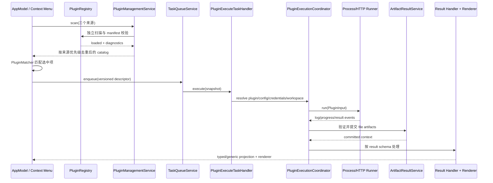
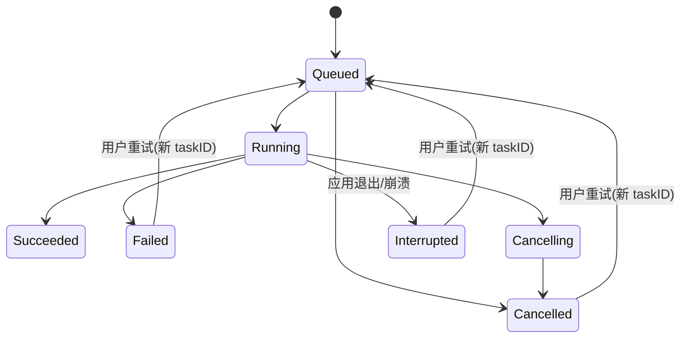

# OpenFinder 插件机制

本文解释插件从发现到呈现的完整生命周期，以及各阶段为何分离。字段定义和示例请查 [`plugin-api.md`](plugin-api.md)；HTTP 线协议以 [`plugins/http-plugin-v1.md`](plugins/http-plugin-v1.md) 为准。

## 核心原则

插件机制遵守五个不变量：

1. 插件包是数据和代码的外部输入，扫描失败必须隔离到单个包。
2. durable task 保存不可变插件版本、action、配置快照和凭据引用；不保存明文凭据。
3. process 与 HTTP 只是在 `PluginRunner` 下的 transport 差异，终端结果、工件和呈现规则共用。
4. 结果按 `output.resultType` 路由，不能按插件 ID 增加业务分支。
5. 工件在临时 workspace 清理前完成验证和持久提交。

## 生命周期总览



PlantUML 版本见 [`diagrams/plugin-execution.puml`](diagrams/plugin-execution.puml)。

## 1. 发现与目录优先级

应用独立扫描以下目录：

| 来源 | 目录 | 优先级 |
| --- | --- | --- |
| Built-in | App bundle 的 `Contents/Resources/BuiltinPlugins/` | 3 |
| User | `~/Library/Application Support/OpenFinder/Plugins/` | 2 |
| Development | 当前工作目录的 `ExamplePlugins/` | 1 |

只有真实目录且后缀为 `.openfinderplugin` 或 `.plugin` 的包会被解析。包目录、`manifest.json` 和 process entry 的符号链接逃逸都会被拒绝。

`scanWithDiagnostics` 对每个子目录独立处理，因此一个坏插件不会隐藏合法兄弟插件。`resolveCatalog` 按插件 ID 分组，保留最高优先级来源；同一来源再按规范化路径稳定排序。被忽略项以 `duplicateID` 诊断显示在设置界面。

## 2. Manifest 与执行类型

当前有两个互斥 schema：

| Schema | 执行描述 | Runner |
| --- | --- | --- |
| `1` | 顶层 `runtime` + `entry` | `ProcessPluginRunner` |
| `2` | `execution.type = "http"`、protocol/endpoint/token keys | `HTTPPluginRunner` |

schema 1 不能出现 `execution`；schema 2 不能出现顶层 `runtime` 或 `entry`。HTTP 目前只接受 protocol version 1，并要求 endpoint configuration key 和 token secret key 在 manifest 中有对应声明。

Manifest permissions 在当前进程 runner 中是审计/UX 声明，不是系统 sandbox。它仍参与凭据存储解析、HTTP endpoint 限制和是否允许外部命令等边界判断。

## 3. Action 匹配

`PluginMatcher` 先应用 selection：

- `minItems`；
- 可选 `maxItems`；
- `allowDirectories`。

再应用 `match`：

- 每个文件内部：extension、UTType、MIME 三类非空规则必须同时满足；
- `matchMode = all`：所有选中项都必须匹配；
- `matchMode = any`：至少一个选中项匹配；
- 某类规则为空表示该类不限制；
- `match = null` 表示只应用 selection。

Action 是否可见只代表 manifest 匹配成功。提交前仍要检查文件源能力和 durable readiness；执行前还会按持久快照重新解析插件与凭据。

## 4. 配置与凭据

普通配置来自 manifest defaults 与 `AppConfiguration.pluginConfigurationValues[pluginID]`。只有 manifest 声明过的 key 会进入 `PluginInput.config`。

敏感值分两类：

| Manifest 字段 | 存储 | 适用场景 |
| --- | --- | --- |
| `keychainSecrets` | macOS Keychain | 远端密码、服务密钥等长期凭据 |
| `localSecrets` | 0600 的 `config.json` | 同一用户控制的 loopback 服务 token |

同一个 key 不能同时出现在两类列表，也不能在同一列表重复。持久任务只保存 `PluginCredentialReference`：

- Keychain reference：`plugin.<pluginID>.<key>`；
- local reference：长度前缀编码的 `local-config.plugin.v1...`。

执行时 `PluginCredentialResolver` 才读取真实值。Process runner 将真实值放入生成的环境变量，并在 stdin JSON 中只给出 `{ "env": "..." }`；HTTP runner 将 token 只放入 `Authorization: Bearer` header，禁止复制到 `PluginInput`。

## 5. Durable 提交

UI 不直接调用 runner，而是创建 `PluginTaskEnvelope` 和 `TaskDescriptorEnvelope`：

- 插件 ID、精确 version 和 action ID；
- task UUID、root/parent/attempt；
- app/context/file snapshots；
- 普通配置值；
- secret references；
- result schema；
- transport-specific workspace policy。

`PluginExecuteTaskHandler` 在执行时通过 `AppPluginTaskResolver` 要求同 ID、同版本、同 action 仍存在。缺失插件、版本、action 或凭据会转成可解释的 unavailable/failed 状态，不会静默选择另一个版本。

重试复制不可变业务快照，但生成新 task UUID 和新 attempt。对 HTTP 插件而言，新 UUID 也是一个全新的远端 job；旧 job 不会被复用。

## 6. Workspace

每次执行都获得 `tempDirectory` 和 `outputDirectory`：

- process + 本地 pane：输出目录可为当前本地目录，使生成文件出现在原位置；
- process + 非本地 pane：输出到任务临时目录；
- HTTP：使用独立任务根，避免把服务写入与当前 pane 生命周期耦合；
- file artifact 的 `relativePath` 始终相对 output directory。

任何要持久呈现的文件必须作为 artifact 事件返回。仅写入临时目录但未声明的文件不会进入结果系统。

## 7. Transport 路由

`PluginRunnerRouter` 根据 manifest 的 `PluginExecution` 选择 transport，并记录 `taskID -> transport`，因此取消只发送给实际运行该任务的 runner。

### Process runner

`ProcessPluginRunner`：

1. 根据 runtime 选择 `/bin/zsh`、配置的 Python/Node 路径或 `/usr/bin/env` fallback；
2. 将一个 `PluginInput` JSON 写入 stdin；
3. 并发读取 stdout 与 stderr，避免 pipe 缓冲死锁；
4. 逐行严格解析 NDJSON；
5. 将 log/progress 实时回调给 task queue；
6. 要求退出码为 0，且最后一行是唯一的 `result.status = success`。

取消会终止子进程。非零退出、未知事件字段、非法 progress、缺少/重复 terminal result 都是失败。

### HTTP runner

`HTTPPluginRunner`：

1. 从配置解析数字 loopback URL，从凭据引用解析 bearer token；
2. 请求 `/health` 和 `/capabilities` 协商；
3. 用 task UUID 向 `/jobs` 幂等提交同一个 `PluginInput`；
4. 优先消费 SSE；可按 capabilities 使用 snapshot polling；
5. 短暂断线只允许以 `Last-Event-ID` 连接同一存活 job；
6. 获取并验证唯一终端 result。

服务重启、`job_not_found`、事件历史过期或 taskID 不一致都会使本次 attempt 失败。详见规范性 [HTTP v1 文档](plugins/http-plugin-v1.md)。

## 8. 统一事件语义

两个 runner 最终都产生：

```text
PluginRunResult {
  exitCode
  stdout
  stderr
  events: [log | progress | result]
}
```

`PluginExecutionCoordinator` 不信任 runner 的“成功”描述，而是再次检查：

- exit code 为 0；
- 恰好一个 terminal result；
- terminal result 是最后一个事件；
- `success` 才继续；`failure` 抛错；`cancelled` 转为取消。

这使 process 与 HTTP 共享相同的上层完成条件。

## 9. 工件边界

Result artifact 有两种 payload：

- inline：`type + content`；
- file-backed：`type + artifactID + relativePath + mediaType + byteCount + sha256`。

`ConfinedArtifactReader` 和 `ArtifactStore` 共同拒绝绝对路径、`..`、符号链接逃逸、尺寸不一致和哈希不一致。工件经过 stage、publish、link、commit 后才可由 `ArtifactResultService.open/fileURL/export` 访问。

`mediaAnalysis.v1` 有额外约束：

- 正好一个同 type 的 schema artifact；
- JSON 文档 schema/version 有效；
- 文档 taskID 等于当前 taskID；
- 文档引用的 artifact ID 必须存在；
- 临时 asset path 在提交时改写为持久相对路径。

## 10. Result handler 与 renderer

提交完成后，`PluginResultHandlerRegistry` 按 schema ID 选择 handler：

| Schema | Projection |
| --- | --- |
| `mediaAnalysis.v1` | 解码并验证 `MediaAnalysisDocument` |
| 未注册 schema | `UnknownPluginResult`，保留消息与 artifacts |

App 层的 `PluginRendererCatalog` 再按同一 schema ID 和 typed projection predicate 选择 renderer。已知 schema 但 projection 类型不符时仍回退 generic renderer，避免强制转换或插件 ID 特判。

因此新增同 schema 的 producer 不需要新增 SwiftUI view；只有公开了全新结果 schema 才需要评估新 handler/renderer。

## 11. 取消、失败与恢复



启动恢复不会猜测外部副作用：

- 未提交效果的 running/cancelling task 变为 interrupted；
- descriptor 与精确 handler 可用时允许新 attempt；
- `effectsCommittedAt` 防止把已提交工件的任务当作可安全重跑；
- HTTP 服务端 job 不跨服务重启恢复。

## 12. 安全模型与明确限制

可信度从高到低：

1. OpenFinder Core 的领域与持久化不变量；
2. 已验证的 manifest；
3. runner 转换后的事件；
4. 插件 workspace 中的文件；
5. 插件进程/本机 HTTP 服务本身。

当前限制：

- process 插件与用户同权限运行；
- `permissions` 尚未由 XPC entitlement 强制执行；
- HTTP v1 仅适合同机 loopback 服务；
- plugin ID/version 不是代码签名身份；
- 用户安装插件前仍需信任其代码来源。

## 相关文档

- [插件 API 参考](plugin-api.md)
- [HTTP 插件协议 v1](plugins/http-plugin-v1.md)
- [Renderer Catalog](renderer-catalog.md)
- [持久化任务与恢复](task-recovery.md)
- [系统架构](architecture.md)
